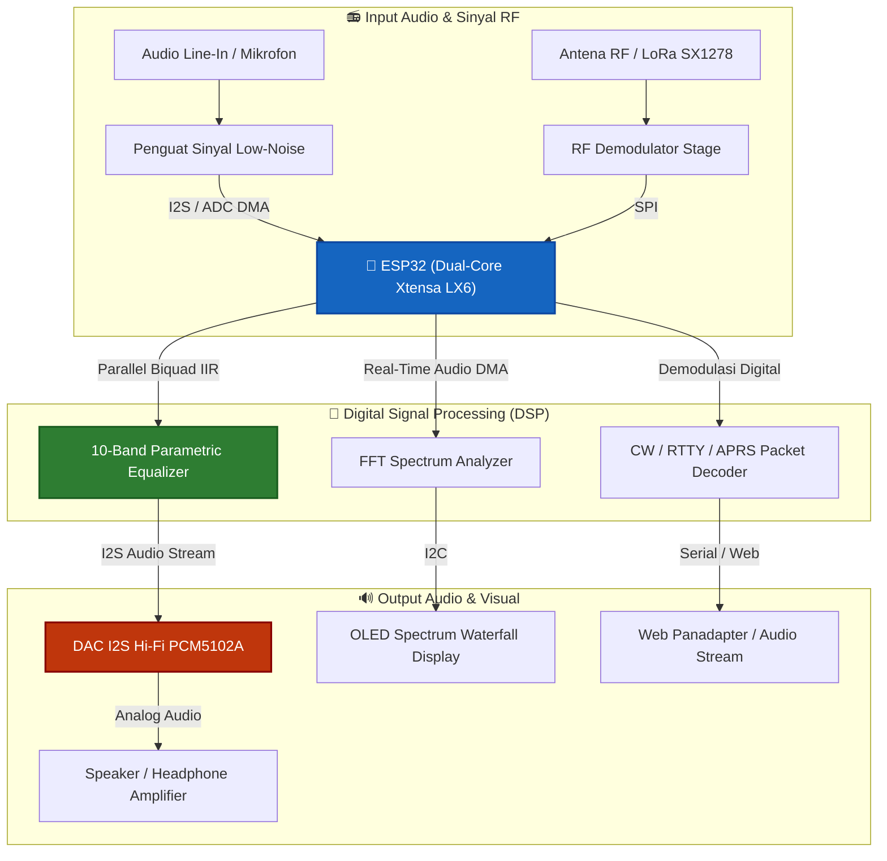

# ⚡ ESP32 Industrial SCADA RTU Gateway (DNP3 / IEC 60870-5-104)

Smart substation telemetry Remote Terminal Unit (RTU) supporting binary inputs, analog inputs, and select-before-operate control relays with sequence of events (SOE) timestamping.

---

## 📊 Diagram Blok Arsitektur & Skema Alur Rangkaian

Visualisasi interaktif alur daya, akuisisi sinyal sensor, pemrosesan algoritma inti, dan aktuasi proteksi perangkat:

---

## 📦 Daftar Komponen & Bahan Lengkap (Bill of Materials - BOM)

Berikut rincian spesifikasi komponen fisik dan modul yang dibutuhkan untuk membangun proyek ini:

| No | Nama Komponen / Modul | Estimasi Jumlah | Fungsi & Spesifikasi Teknis |
|:---|:---|:---|:---|
| 1 | **ESP32 Dev Module (30/38-Pin)** | 1 Unit | Mikrokontroler Dual-Core dengan FreeRTOS, Wi-Fi 2.4GHz & BLE |
| 2 | **Regulator Step-Down LM2596 / PSU 5V 2A** | 1 Unit | Sumber daya listrik 5V DC teregulasi |
| 3 | **Modul Audio DAC / ADC I2S (PCM5102A / MAX98357A / Audio Codec)** | 1 Unit | Konverter digital-ke-analog audio stereo 24-bit 48kHz |
| 4 | **Potensiometer Geser / Rotary Encoder Parameter Audio** | 4 Unit | Pengatur gain frekuensi filter audio parametrik |
| 5 | **Modul Transceiver RF / LoRa SX1278 (433/915MHz)** | 1 Unit | Transmisi paket data komunikasi radio digital |
| 6 | **Layar OLED Grafis SSD1306** | 1 Unit | Visualisasi spectrum analyzer waterfall & VU meter |
| 7 | **Jack Audio 3.5mm Stereo dengan Rangkaian Filter RC** | 2 Unit | Konektor input & output audio standar |

---

## 🧠 Arsitektur Sistem & Fitur Utama

- **FreeRTOS Multi-Core Priority Scheduling:** Memisahkan pemrosesan sinyal presisi tinggi dari task telemetri untuk mencegah *latency jitter*.
- **Digital Signal Processing (DSP) & Filtering:** Dilengkapi algoritma digital filtering terdedikasi untuk eliminasi derau sinyal analog.
- **Non-Volatile Storage (NVS Preferences Flash):** Parameter kalibrasi, *setpoint*, dan konfigurasi tersimpan secara persisten terhadap siklus pemadaman daya.
- **Hardware Failsafe & Emergency Interlock:** Perlindungan otomatis jika terjadi anomali tegangan, kelebihan beban arus, atau pemicuan tombol *Emergency Stop*.
- **Industrial Telemetry & Diagnostics:** Pelaporan status operasional secara real-time via Serial/JSON stream.

---

## 🔌 Skema Pinout & Koneksi Hardware

| Komponen / Sinyal | Pin (ESP32) | Deskripsi Fungsi |
|:---|:---|:---|
| **Sensor Analog Input** | `GPIO 36 (ADC1)` | Jalur pembacaan sensor utama berpresisi tinggi |
| **Emergency Stop (E-Stop)** | `GPIO 34` | Pemicu pengaman darurat hardware interrupt |
| **Actuator / Relay Utama** | `GPIO 26` | Pengendali beban daya tinggi / relay aktuator |
| **Acoustic Alarm Buzzer** | `GPIO 25` | Indikator peringatan audible saat terjadi anomali |
| **Status / Heartbeat LED** | `GPIO 2` | Indikator status aktivitas sistem real-time |

---

## 🛠️ Panduan Perakitan Hardware (Langkah Demi Langkah)

1. **Persiapan Catu Daya:** Hubungkan catu daya utama ke jalur daya mikrokontroler. Pasang kapasitor *decoupling* 100nF di dekat pin VCC untuk meredam ripple switching.
2. **Pemasangan Sensor & Modul:** Sambungkan jalur sinyal sensor ke pin mikrokontroler yang telah ditentukan. Gunakan resistor pull-up 4.7kΩ pada jalur SDA/SCL jika menggunakan modul I2C.
3. **Pemasangan Aktuator:** Hubungkan modul relay / gate driver MOSFET ke pin kontrol output. Pasang dioda *flyback* (1N4007) pada beban induktif untuk mengeliminasi lonjakan tegangan balik (*back-EMF*).
4. **Pemasangan Tombol Emergency Stop:** Sambungkan tombol darurat ke pin interupsi eksternal dengan konfigurasi *Active-LOW* menggunakan resistor *pull-up*.
5. **Verifikasi Koneksi:** Lakukan pengecekan jalur ground bersama (*Common Ground*) pada seluruh modul sebelum menyalakan daya.

---

## 🚀 Panduan Kompilasi & Upload (Arduino IDE)

1. Buka **Arduino IDE 2.0+**.
2. Masuk ke menu **Tools > Board**:
   * Pilih **`ESP32 Dev Module`**.
3. Pastikan dependensi pustaka terpasang via Library Manager:
   * `ArduinoJson`
   * `Wire` & `SPI`
   * `Preferences`
4. Buka berkas [`esp32-scada-dnp3-rtu-gateway.ino`](./esp32-scada-dnp3-rtu-gateway.ino).
5. Klik tombol **Verify** (✓) kemudian **Upload** (➔).
6. Buka **Serial Monitor** pada baudrate **`115200`** untuk melihat streaming telemetri dan status operasional.

---

## 📄 Lisensi
Didistribusikan di bawah lisensi open-source **MIT License**. Dikembangkan oleh **Muhammad Fikri**.
